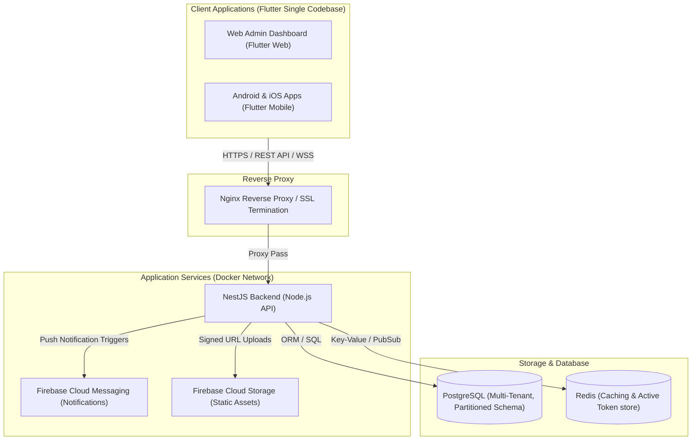

# System Architecture & Deployment Blueprint

## 1. High-Level System Architecture

Manchester School Bridge implements a modern, secure, and distributed architecture.



---

## 2. Multi-Tenant Architecture Pattern

To serve thousands of schools efficiently, the database utilizes a **Shared Database, Isolated Schemas (Logical Separation)** or a **Single Schema with Tenant ID (Dynamic RLS Policies)** model. 
For Manchester School Bridge, a robust **Single Schema with Row-Level Security (RLS) and Shared Database** is implemented, using a composite unique identifier:
- `school_id` (UUIDv4) - Defines the Tenant context.
- All dynamic API queries are routed through a NestJS Tenant Interceptor which extracts the `X-Tenant-ID` header, validates it, and dynamically scopes PostgreSQL execution context using raw parameter bindings or ORM constraints.

---

## 3. Flutter Architecture (Clean Architecture + MVVM)

The Flutter mobile and web client codebase is structured under the Clean Architecture paradigm, decoupled into three core layers:

```
┌────────────────────────────────────────────────────────┐
│                      Presentation                      │
│        (UI Widgets, Riverpod Providers, ViewModels)     │
└───────────┬────────────────────────────────┬───────────┘
            │                                │
            ▼ (Calls Use Cases)              ▼ (Watches View State)
┌────────────────────────────────────────────────────────┐
│                         Domain                         │
│       (Entities, Use Cases, Repository Contracts)       │
└───────────┬────────────────────────────────────────────┘
            │
            ▼ (Implements Contracts)
┌────────────────────────────────────────────────────────┐
│                          Data                          │
│     (Data Sources [Remote/Local], DTO Models, Repo)    │
└────────────────────────────────────────────────────────┘
```

- **Domain Layer**: The analytical core, containing core platform models (Entities), interface contracts, and functional workflows (Use Cases). Independent of external packages (except pure Dart code).
- **Data Layer**: Infrastructure management, converting raw API requests (DTOs) into clean Domain Entities. Implements repository contracts.
- **Presentation Layer**: Follows the **MVVM (Model-View-ViewModel)** pattern. Riverpod providers manage ViewModels, listening to user events, invoking Use Cases, and publishing reactive states back to Material 3 UI widgets.

---

## 4. NestJS Architecture (Modular Framework)

The NestJS backend acts as a highly structured API provider:

- **Modular Division**: Each module (e.g., `attendance`, `fee`, `homework`) is decoupled, containing its own Controllers, Services, Entities, and Providers.
- **Global Pipes**: Validate input schemas using `class-validator` and convert parameter formats.
- **API Guards**: Implement JWT authorization alongside RBAC rules (e.g., `@Roles(Role.TEACHER)`).
- **Tenant Interceptor**: Validates the `X-Tenant-ID` header for all requests and injects the parsed tenant data into the request object for database query building.

---

## 5. Security Architecture

1. **Authentication Flow**:
   - Client sends user credentials.
   - Server returns JWT Access Token (expiry: 15m) and Refresh Token (expiry: 7d).
   - Refresh tokens are hashed and stored in the database. When the Access Token expires, the client uses the Refresh Token to fetch a new pair.
2. **Access Control**:
   - Permission Guard evaluates request route metadata against the user's role array.
3. **Data Security**:
   - Sensitive information (e.g. passwords) is hashed via `bcrypt` with a salt factor of 12.
   - Direct downloads of school circulars and homework are signed and mediated via NestJS streams.
