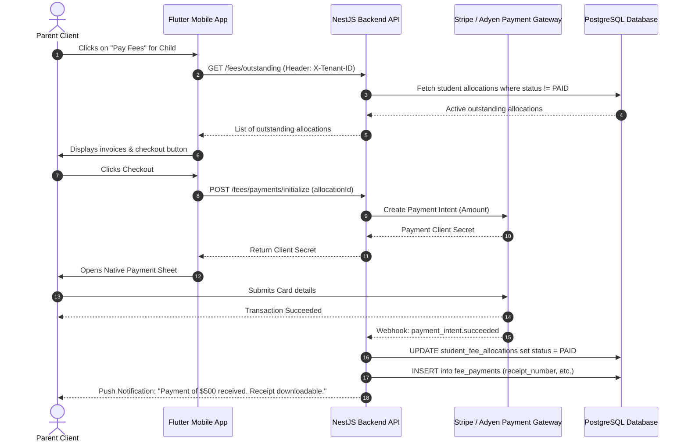

# Navigation Hierarchy & User Flows

This blueprint defines how screens are organized via GoRouter routing, along with role-specific interactive journeys.

## 1. Global Navigation Hierarchy (GoRouter Routes)

```
/ (Root Redirect / Splash)
│
├── /login                            (Anonymous Screen)
├── /otp-verify                       (OTP Verification screen)
│
├── /super-admin                      (Super Admin Dashboard)
│   ├── /schools                      (Schools list)
│   └── /subscriptions                (Global SaaS subscription plans)
│
├── /admin                            (School Admin Dashboard)
│   ├── /profile                      (School profile configuration)
│   ├── /classes                      (Manage Classes & Sections)
│   ├── /teachers                     (Manage Teacher staff)
│   ├── /students                     (Manage Students & Parents)
│   ├── /fees                         (Configure Fee structures)
│   └── /notices                      (Post global notices)
│
├── /teacher                          (Teacher Dashboard)
│   ├── /attendance                   (Class list & Mark attendance)
│   ├── /homework                     (Upload homework / assignments)
│   ├── /marks                        (Term grade entry sheets)
│   └── /leaves                       (Leave requests dashboard)
│
├── /parent                           (Parent Dashboard)
│   ├── /child-profile                (Select sibling / View student info)
│   ├── /attendance-view              (Calendar view of child's attendance)
│   ├── /homework-view                (Assigned homework task board)
│   ├── /marks-view                   (Virtual Report Card card view)
│   ├── /fees-payment                 (Invoice checkout gateway)
│   └── /apply-leave                  (Submit student leave request)
│
├── /student                          (Student Dashboard)
│   ├── /timetable                    (Academic schedule view)
│   ├── /homework                     (Homework tasks list)
│   ├── /notes                        (Shared learning resources)
│   └── /exams                        (Schedule & hall ticket details)
│
└── /accounts                         (Accounts Staff Dashboard)
    ├── /payments                     (Log payments & checkouts)
    ├── /defaulters                   (Track unpaid fee statuses)
    └── /reports                      (Export accounting sheets)
```

---

## 2. Dynamic Parent Payment Flow


